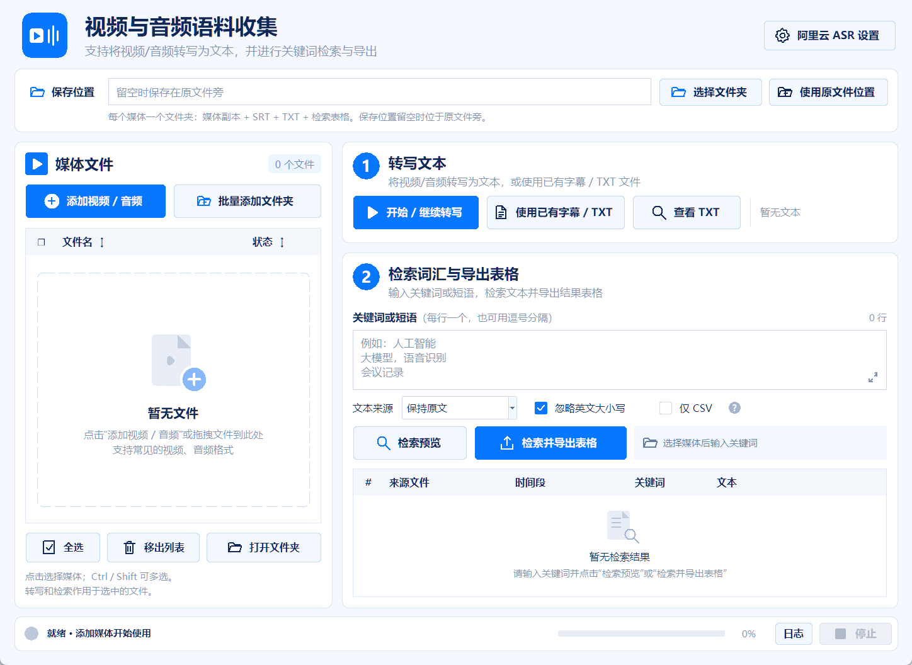

# Corpus Collector · 视频与音频语料收集

**面向语言学研究者，尤其是方言研究者的视频与音频语料收集工具。** 将访谈、田野录音、课堂记录等媒体整理为可检索的文本，再把目标词汇或短语及其上下文导出为研究用表格。

本工具使用阿里云千问 ASR。默认模型 qwen3-asr-flash 支持多种语言和中文方言；官方文档列出的中文范围包括普通话、四川话、闽南语、吴语和粤语。因此，它也可用于这些方言材料的初步转写与语料整理。具体覆盖范围随模型版本变化，请以 [阿里云模型说明](https://help.aliyun.com/zh/model-studio/asr-model) 为准。

工具只聚焦两项功能：

1. **视频／音频转写文本**：使用阿里云 ASR，生成字幕 SRT 和文本 TXT，也可使用已有字幕或文本。
2. **文本检索词汇，输出表格**：检索研究者指定的词汇或短语，将命中、来源、时间段与上下文导出为 CSV/XLSX。

**添加媒体 → 转写文本 → 检索词汇与导出表格。** 每个媒体自动建立一个文件夹，媒体副本、字幕、文本与表格放在一起。

*A desktop corpus collection tool for linguists and dialect researchers: audio/video transcription with Alibaba Cloud ASR, keyword concordance search, and per-media CSV/XLSX export.*



## 用于语言学与方言研究

访谈或田野录音可先自动转写，再检索目标词、口语表达或构式中的固定短语，汇集例句及上下文。CSV/XLSX 便于随后人工核对、编码和分析；来源与时间段帮助研究者回听原始材料。

自动识别结果应作为转写初稿。方言词、语气词、专名、重叠说话及噪声较大的片段需要结合原音核对；当前工具不生成音标、声调或研究分类标注。SRT 时间对应音频分块，不能用于精细的语音对齐分析。

详见 [语言学研究使用建议](docs/研究者使用指南.md)。

## 文件如何保存

例如添加“访谈01.mp4”后：

```text
访谈01/
├── 访谈01.mp4                       媒体副本
├── 访谈01.srt                       转写字幕
├── 访谈01.txt                       转写文本
├── 访谈01-检索-20261003-….csv         检索结果
├── 访谈01-检索-20261003-….xlsx        检索结果
└── .corpus/                         自动保存的运行状态与断点
```

添加另一份媒体时建立另一个文件夹。默认保存在原媒体旁，也可指定统一的保存位置。原文件保留，工具复制一份媒体，因此需为媒体副本预留磁盘空间。

重复添加同一媒体会继续使用已有文件夹；不同位置的同名媒体分别存为“访谈01”和“访谈01 (2)”。每次检索导出使用新的文件名，保留已有表格。

## 快速开始

需要 Python 3.10+（建议 3.12，带 Tkinter）；转写需要 FFmpeg。Windows 双击 **setup.cmd** 安装依赖，再双击 **start.cmd** 打开界面。识别在阿里云完成，本地不需要 GPU；转写需要自己的阿里云 API Key，并按服务计费。已有文本的检索和导出不调用云端。也可在源码目录执行：

```powershell
python -m pip install -r requirements.txt
python launch.py
```

1. 点击“添加视频 / 音频”，或将媒体、文件夹拖入左侧媒体区。每个文件会复制到各自的同名文件夹，出现在左侧列表。
2. 在左侧选中要处理的媒体；Ctrl/Shift 可多选，“全选”用于批量处理。
3. 点击“阿里云 ASR 设置”填写自己的 Key，点击“开始 / 继续转写”。
4. 在右侧第二步输入关键词，点击“检索并导出表格”。每个选中媒体的表格都保存在它自己的文件夹里。
5. 左侧“打开文件夹”查看媒体、字幕、TXT 和导出表格。

设置 FFmpeg 可把其 bin 目录加入 PATH，或在 ASR 设置中填写 ffmpeg.exe 完整路径。媒体文件的添加、复制、转写与检索使用后台任务；底部“日志”查看任务详情，复制和转写支持停止。

界面按“媒体文件 → 转写文本 → 检索词汇与导出表格”排列。列表标题可排序，复选框可选择文件；关键词框显示行数，右下角可展开编辑。点击检索结果查看命中上下文。文件拖放由 [tkinterdnd2](https://github.com/Eliav2/tkinterdnd2) 提供；系统无法加载拖放组件时，仍可通过按钮添加媒体。

## 已有字幕或文本

原媒体旁已有同名 SRT/TXT 时，添加媒体会自动读取，SRT 优先，随后生成对应 TXT。两个文件不会被重复计入检索。

也可选中一个媒体，点击“使用已有字幕 / TXT”，关联任意 SRT、TXT、CSV、XLSX。已有文本替换该媒体的当前检索文本，旧的生成文件备份在 .corpus/history/。只有 TXT 或无时间表格时不生成虚构的字幕时间，结果时间列留空。

关闭程序后，重新添加已整理文件夹里的视频/音频即可继续。整个媒体文件夹可以移动；转写读取文件夹内的媒体副本。

## 检索表格

每次命中一行，同一段出现多次分别记录。字段包含：来源媒体文件、序号、开始时间、结束时间、关键词、匹配文本、本段第几次命中、左右上下文、文本、原始文本、起止字符位置。

关键词按字面匹配，不执行正则表达式，匹配不重叠；界面默认勾选“忽略英文大小写”，可取消，命令行用 --ignore-case 开启。关键词可用换行或逗号分隔。可选繁转简/简转香港繁体，查询与文本一起转换，原始文本仍保留。

CSV 使用 UTF-8 BOM；XLSX 将语料作为文本单元格，CSV 对公式前缀加保护。完整命中记录和导出完成状态在 .corpus/exports/ 保存为 JSON。替换或重新转写文本后需重新检索，避免导出旧文本的命中。

表格输入格式与恢复方式见 [使用说明](docs/使用说明.md)。

## 阿里云配置

API Key 在设置窗口填写，仅本次运行使用，不保存到语料文件夹或日志。命令行读取环境变量：

```powershell
$env:DASHSCOPE_API_KEY = "填写自己的密钥"
python launch.py doctor
```

默认模型 qwen3-asr-flash，默认地址为北京地域的兼容接口。地域、Key 和模型权限需匹配。语言留空自动识别，或指定 zh/en/yue 等模型支持的语言；配置项参考 .env.example，程序不自动读取 .env。接口详见 [阿里云官方说明](https://www.alibabacloud.com/help/en/model-studio/qwen-asr-api-reference)。

音频切块在本地生成，执行转写时发送到阿里云；已有文本的检索、转换和导出在本地完成。

## 命令行

直接传入媒体文件或包含媒体的文件夹，不需要建立一个集中语料项目：

```powershell
# 添加媒体，指定统一保存位置（可省略 --output，默认在原媒体旁）
python launch.py add "D:\videos\访谈01.mp4" --output "D:\语料"

# 转写：再次提供原媒体和相同保存位置，或直接提供已整理的媒体副本
python launch.py transcribe "D:\语料\访谈01\访谈01.mp4"

# 查询并导出：每个文件单独保存表格
python launch.py search "D:\语料\访谈01\访谈01.mp4" --keywords "数据" "apple" --ignore-case

# 已有文本可指定给一个媒体
python launch.py search "D:\语料\访谈01\访谈01.mp4" --text "D:\texts\访谈.txt" --keywords "数据"

# 批量完成添加、转写与检索导出
python launch.py pipeline "D:\videos" --output "D:\语料" --keywords "数据" --csv-only
```

已具备文本的媒体会跳过 ASR，可在无密钥情况下检索和导出。部分文件失败时保存其他文件的成功结果，命令行以非零退出码报告错误。可安装为命令行包：`python -m pip install ".[conversion]"`，随后运行 `corpus-collector`。

## 范围与验证

SRT 时间对应固定音频块的起止时间，不是逐字或逐句精确对齐。默认每段 60 秒，可设为 5–120 秒，重要语料应听原音核对。全部音频块返回空文本时不标记完成。

运行 `python -m unittest discover -s tests -v` 验证。测试覆盖逐媒体目录、真实文件复制、同名避让、已有字幕、中文/英文检索、CSV/XLSX、目录移动、断点恢复及离线 CLI；ASR 使用模拟服务。真实付费请求未执行。

源码包不含私人语料、媒体、密钥或运行环境。推荐将整理媒体保存到源码仓库外；.gitignore 排除 .corpus、媒体、生成的 TXT/SRT/CSV/XLSX。

## 许可

代码采用 [MIT 许可证](LICENSE)。示例字幕和表格是用于演示与测试的合成数据。
